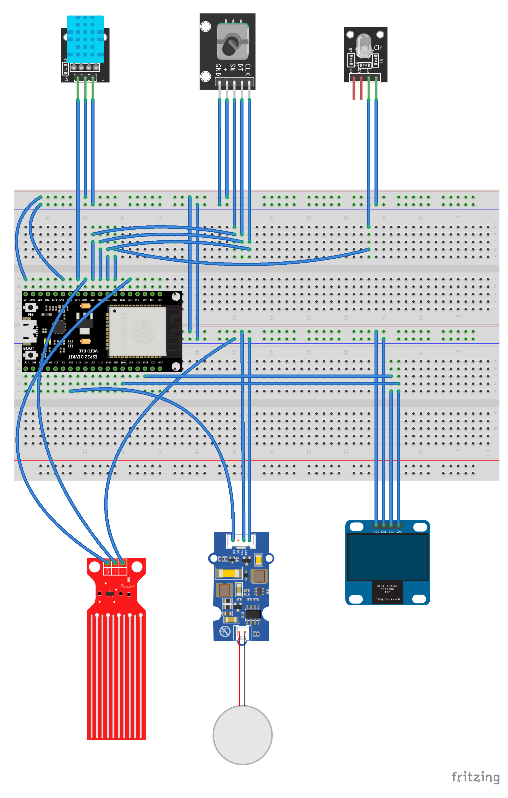

# Umidificatore Smart

**Autori**: Davide Carniselli

## Descrizione
Umidificatore Smart, con due modalità di funzionamento: *intermittenza* e *automatica*.

Nella modalità ad intermizzenta, l'umidificatore atomizzerà l'acqua presente nel *serbatoio* con un ritmo costante, nella modalità automatica l'umidificatore si servirà di vari sensori di *temperatura* e di *umidità* per acquisire dati dall'ambiente e atomizzare l'acqua solo quando necessario.

All'interno del serbatoio sarà presente un *water level sensor* per bloccare l'atomizzazione e notificare l'utente in caso di mancanza d'acqua.

Sarà presente un *display oled* sul quale verranno visualizzate le varie informazioni, come umidità e temperatura dell'ambiente.

Le varie informazioni che si andranno a generare saranno anche riportate in MQTT.

## Lista Materiali
- esp32
- potenziometro
- led
- oled (128x64)
- dht11
- water level sensor
- atomizzatore acqua (es. [grove](https://wiki.seeedstudio.com/Grove-Water_Atomization/))
- contenitore per acqua

## Schema breadboard

## Schema Elettrico

## Licenza scelta
GNU GENERAL PUBLIC LICENSE version 3 (GPLv3)
